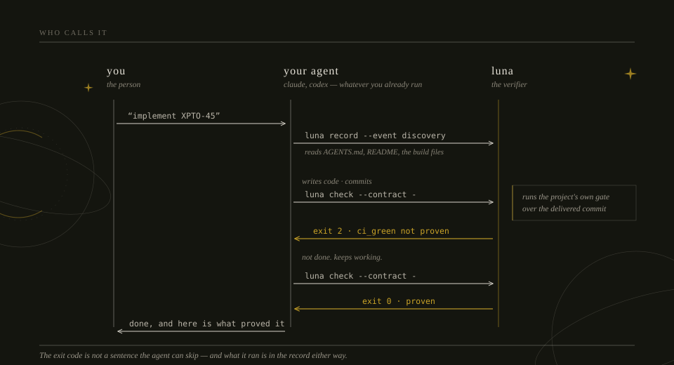
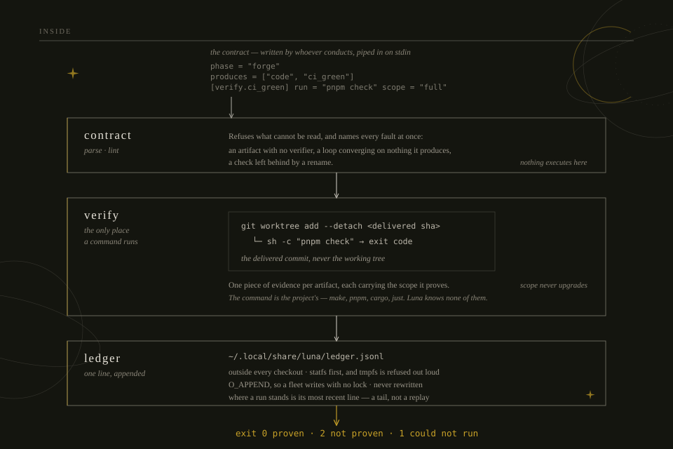
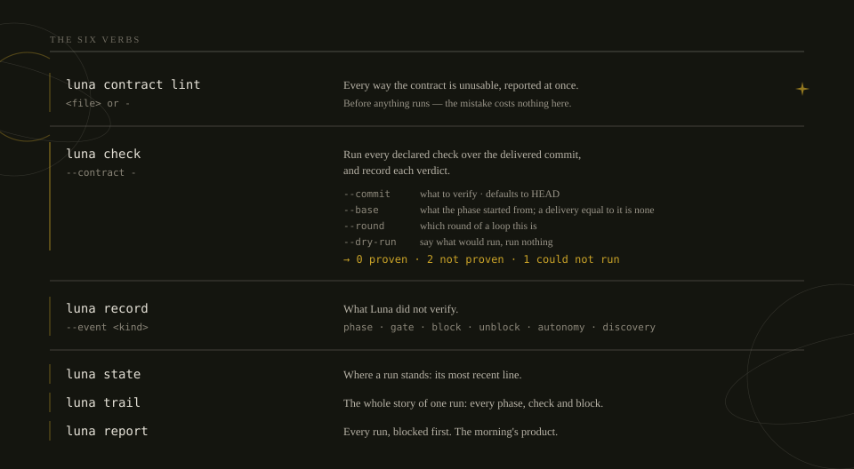

# Luna

**An agent will tell you the tests pass. Luna runs them.**

Coding agents produce completion language whether or not the work is done — "tests
passing" while the suite is red, files "created" that exist only in the prompt. The usual
answer is more prose in the instructions. Luna's answer is to run the command and read the
exit code, over **what was actually committed**.

## Who calls it

**You don't.** Luna is a tool your *agent* runs, at the boundary between two phases of
work. You keep the setup you already have.



The agent cannot skip this the way it can skip a sentence in a prompt: the exit code is
not a suggestion, and what it ran is in the record either way.

## What it is not

Luna does not run your agent, open your worktree, build your sandbox, or decide what
happens next. Those belong to whatever you already use. It does three things nothing else
in a typical setup does:

- **Verification that ran.** A command returning zero over the delivered commit — not over
  the working tree, where an uncommitted file or a stale build artifact makes a green
  meaningless.
- **A contract.** What a phase owes and how each debt is proven, checked on the way out.
  Evidence carries how much it proves, and `existence` — "the artifact is there, nothing
  more is claimed" — is an honest answer.
- **A floor under the loop.** The model judges whether a round made progress; it may not
  declare the loop finished while the command it converges on is red.

## Inside

Four pieces, and only one of them decides anything.



**Where a run stands is its most recent line** — read by tailing, not by replaying. Luna
decides no transitions, so it has no state to reconstruct, only a position to report.

Nothing is written into your repository: no state file, no anchor, no ignore entry. The
ledger knows where the worktree is, rather than the worktree knowing where the ledger is,
so a record outlives the tree it describes.

## The words

| Word | What it means |
|---|---|
| **conductor** | whoever drives the phases — an agent, a skill, a person, a script. Luna is called *by* one and never is one, which is the other half of every "Luna does not decide" here. |
| **run** | one task start to finish, named by an id and carried by the branch `luna/<run>`. |
| **phase** | one named stretch of a run — `forge`, `review`, `close`. Luna knows no list of them and validates no name: which phases exist is the conductor's business. |
| **contract** | what a phase owes, as TOML on stdin. Luna keeps none of it between calls. |
| **artifact** | one thing a phase owes. A verdict is per artifact — "forge failed" cannot say which debt went unmet. |
| **check** | one artifact's verifier being run, and the line it leaves. |
| **scope** | how much a passing check establishes: `full > targeted > human > existence`. It never upgrades. |
| **gate** | a decision handed to a person, with the answer recorded. |
| **block** | a run stopping for missing information, carrying the question, where the answer was looked for, and what would unblock it. |
| **status** | where a run stands, one of six: `running`, `awaiting_gate`, `awaiting_resume`, `blocked`, `done`, `abandoned`. `awaiting_resume` means a batch prepared it and nobody has picked it up yet — that line *is* the handoff, there is no file beside it. |
| **discovery** | what a phase found out about the project — its verification command, how it bootstraps — recorded with the file it was read from, and never consulted afterwards. |

Three of these mean a second thing in ordinary use: **gate** and **check** also name *the
project's own* verification command (`make ci`, `pnpm check`), and **floor** is both the
loop's mechanical floor and the 95% coverage minimum. All six senses are real and none is
being renamed.

**[docs/GLOSSARY.md](docs/GLOSSARY.md) defines every part of Luna in one place** — these
words, the verbs, the six statuses, the seven events, and what Luna deliberately is not.

## Install

```sh
go install github.com/brunoomariano/luna/src/cmd/luna@latest
```

No dependencies. `go.mod` is three lines.

## The seven verbs



A checkout on `luna/<run>` knows which run it is, so `--run` is optional
everywhere. The branch is the authority because it travels with the work, where a
directory can be moved or made by hand.

## Trying it

Write a contract once, as a file:

```toml
# forge.toml
phase    = "forge"
produces = ["code", "ci_green"]

[verify.ci_green]
run   = "make ci"        # this project's own gate — pnpm check, cargo test, …
scope = "full"           # what a zero exit establishes

[verify.code]
kind = "existence"       # nothing proves this, and that is said rather than defaulted
```

```sh
$ luna contract lint forge.toml
forge: 2 owed, ci_green, code

$ luna check --contract forge.toml --run MAX-2
FAIL ci_green                 full       make ci
     FAIL  internal/parser  0.4s · exit status 1
ok   code                     existence  delivered

forge is not proven: ci_green
$ echo $?
2
```

In real use the contract does not live in a file — it comes from the acceptance criteria a
person approved, and the agent pipes it in with `--contract -`. Luna keeps none of it.

## The log of a task

`state` says where a run is. `trail` says what it did — every phase it walked, every
check with its verdict and scope, what it found out about the project, the gates, the
blocks.

```
$ luna trail WID-1
WID-1  github.com/me/widget
done, 9 events

17:19  discovery  setup     gate: node test.js   (package.json scripts.check)
17:19  discovery  setup     bootstrap: pnpm install   (no Makefile here)
17:19  phase      forge     running  round 1
17:19  check      forge     FAIL ci_green   full   r1   node test.js
                            AssertionError: 6 !== 4
17:19  check      forge     ok   ci_green   full   r2   node test.js
17:19  gate       commit    confirm-write approved
17:19  phase      close     done  widen delivered
```

**Nothing here is Luna's command.** `node test.js` came from the contract, which came
from whoever conducts — Luna never learns a project's gate and reuses it. A `discovery`
records what a phase concluded about the repository *and the file it read to conclude it*,
because a finding nobody can check is a claim.

That is what makes the tool project-agnostic: `make ci`, `pnpm check`, `cargo test`,
`just verify` — Luna runs what the contract names and records what it observed.

## What is going on right now

`trail` reads one run. `report` is the listing: every run, what needs a person first.

```
$ luna report --here
needs somebody
  WID-4          awaiting_gate    pr           2h ago
                 which of the two readings did you mean?

in flight
  WID-7          running          forge        3m ago

finished
  WID-1          done             close        1d ago  (2 failed)
```

`--here` keeps it to the repository you are standing in; `--project` names one you are
not, and `--open` drops what has finished. The repository is printed under each run only
when the listing spans more than one — a column repeating the same name is noise.

A run appears under **every** repository its lines name. Runs that moved between two are
not hypothetical: a batch that seeds runs from one checkout stamps that checkout on their
first line, and their later lines name where the work really happened.

## Starting a session

`luna session` opens an agent with what this repository already has open as its first
message, so nobody spends a turn asking what is going on here.

```sh
$ luna session claude          # composes with ai-run, then execs it
$ luna session codex --bare    # no launcher, just the agent
$ luna session --print         # see the briefing, launch nothing
```

```
You are starting work in github.com/me/widget.

Luna has 2 runs open in this repository:

  WID-7  blocked  phase pr  (40m ago)
      blocked on: which of the two readings of criterion 3 holds?
  WID-4  running  phase forge  (2h ago)  1 check failed

Read one with `luna trail <id>` before deciding anything about it.

Ask which one before you act: resume one of the above, or start
something new. Do not choose on your own — an open run is not a request
to continue it.

Conduct the work with the lsh-luna-soul skill.
...
```

**Luna does not stay.** It reads the ledger, composes the briefing and `execve`s the
launcher — after that there is no Luna in the process tree. The sandbox and the durable
memory belong to whatever you already use (`ai-run` here, `--launcher` for anything else);
Luna builds neither.

**And it depends on none of them.** Luna still has zero dependencies: `--bare` starts the
agent with no launcher at all, and naming one that is not installed is refused with what to
do instead. What a launcher needs for itself — `ai-run` prefers `gum` for its menu, and
works without it — is that tool's business, not Luna's.

The skill it names is `--skill`, and an empty one names none — the briefing still says how
to use Luna.

## Blocking

A phase that cannot settle a question from what it has may stop and hand it over — at every
autonomy setting, including `auto`. Running without asking is the point; running without
thinking is how an unattended fleet produces expensive noise.

```
$ luna state --run MAX-2
MAX-2  blocked
  phase     forge

  the question   is --largest meant to return an argument?
  looked in
    the contract, clause 4 — says "the largest", undefined with --max
    tests/ — the combination is not covered
  what unblocks  which of the two readings holds
```

The middle section is required. A block that says only what it wants is indistinguishable
from a phase that did not read what it already had.

## Inside a sandbox

Luna does not build the environment it runs in, so it cannot know from the inside whether
`$HOME` is a tmpfs somebody handed it. There, a ledger write succeeds, reports success and
evaporates. So Luna asks the kernel first, and stops with instructions:

```
the ledger is not on durable storage: ~/.local/share/luna is in memory…
  For ai-jail, that is `rw_maps` in the config, or `--rw-map ~/.local/share/luna`
```

## Documentation

Four files, each answering one question.

| File | Question |
|---|---|
| [architecture.md](docs/architecture.md) | how does it work today? |
| [invariants.md](docs/invariants.md) | what always holds? |
| [decisions.md](docs/decisions.md) | what was chosen, and what was rejected? |
| [lessons.md](docs/lessons.md) | what did building it teach? |

Beside them, [GLOSSARY.md](docs/GLOSSARY.md) answers *what does this word mean?* —
`run`, `phase`, `check`, `discovery`, `trail`, `report` and the rest, each defined once.

## Development

```sh
make ci        # fixes what it can, then verifies. Run before a PR.
make ci-check  # verify only — what remote CI runs
```
