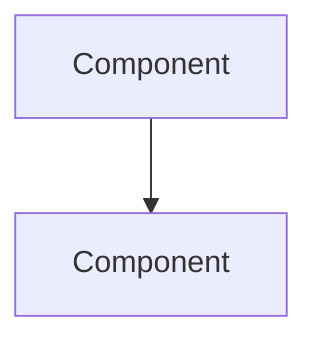

# Architecture: <part of the system>

> How **<part>** is structured today and why. Living document: keep it
> truthful. See the standards in [docs/README.md](../README.md).

## Overview
In a few sentences, what this part is and which responsibility it carries.

## Structure
The pieces that compose it and how they are organized (apps, layers, modules, services).
Use a diagram when it helps.

## Structural decisions
The consolidated structural choices and the reason for each one. For the **dated**
decision that originated a choice, reference the corresponding ADR in
[docs/ADRs/](../ADRs/) instead of repeating the history here.

## Boundaries and responsibilities
What this part does and what it deliberately does **not** do. Where its
boundaries with other parts are.

## Points of attention
Constraints, known bottlenecks or traps for whoever works here.
