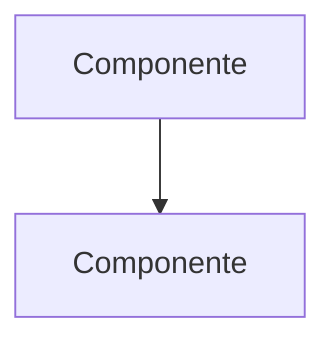

# Arquitetura: <parte do sistema>

> Como **<parte>** está estruturada hoje e por quê. Documento vivo: mantenha-o
> verdadeiro. Ver os padrões em [docs/README.md](../README.md).

## Visão geral
Em poucas frases, o que esta parte é e qual responsabilidade ela carrega.

## Estrutura
As peças que a compõem e como se organizam (apps, camadas, módulos, serviços).
Use um diagrama quando ajudar.

## Decisões estruturais
As escolhas de estrutura consolidadas e o motivo de cada uma. Para a decisão
**datada** que originou uma escolha, referencie o ADR correspondente em
[docs/ADRs/](../ADRs/) em vez de repetir o histórico aqui.

## Limites e responsabilidades
O que esta parte faz e o que deliberadamente **não** faz. Onde estão suas
fronteiras com outras partes.

## Pontos de atenção
Restrições, gargalos conhecidos ou armadilhas para quem mexe aqui.
